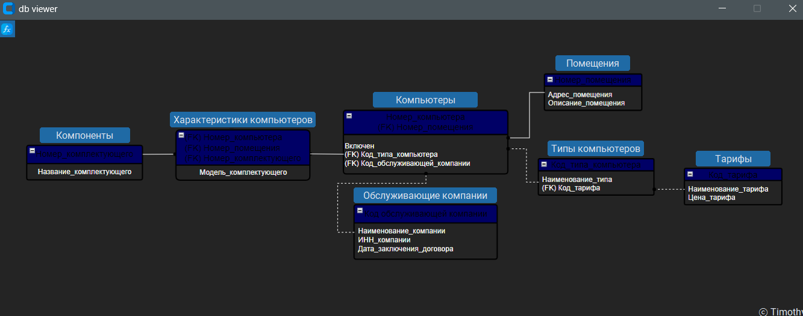
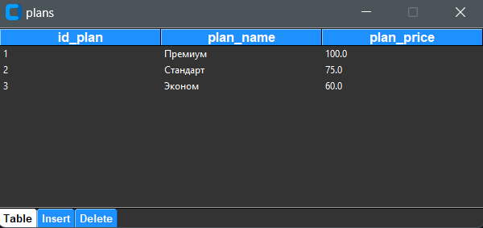
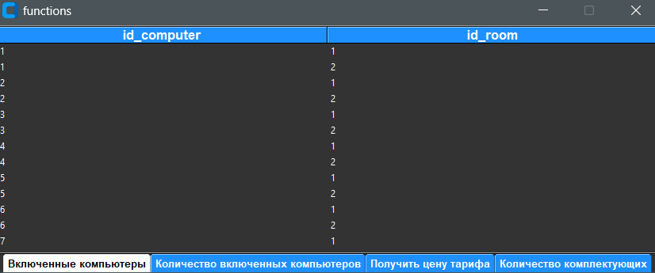

##Computer club information system


**Как запустить приложение**

Перед запуском приложения необходимо запустить СУБД, в нашем случае это Mysql Workbench.

Далее переходим в консоль и запускаем приложение с помощью команды:

```buildoutcfg
python main.py
```

Запустив приложение мы попадаеи на главную страницу, где видна вся структкра системы, таблицы и связи между ними.



Нажав на одну из синих кнопок над таблицей можно перейти в раздел обзора и редактирования выбранной таблицы.



Здесь можно увидеть содержиое таблица а также вставить новую запись или удалить существующую, воспользовавшиь одноименными кнопками "Insert" или "Delete".

Также в верхнем левом углу главной страницы есть кнопка, нажав на которую можно перейти в раздел процедур и функций


Перейдя в раздел функций вы можете воспользоваться любой из четырех предложенных функций


