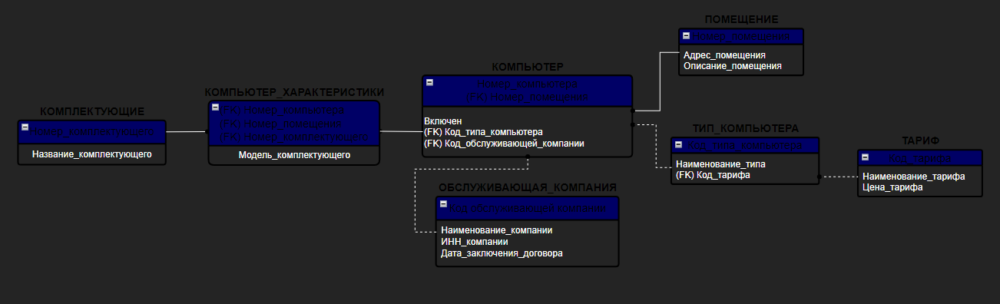

# 🖥 Инструкция пользователя к приложению Computer club information system (CCIS)*

---

## 📌 Описание

**CCIS** — это информационная система для управления данными компьютерного клуба. Она предоставляет графический интерфейс для работы с базой данных, позволяя просматривать, редактировать и анализировать таблицы.

---

## 📦 Установка

1. Убедитесь, что установлен **Python 3.9+**
2. Установите зависимости:

```bash
pip install -r requirements.txt
```

3. Убедитесь, что запущена **MySQL-сервер** (например, через MySQL Workbench)

---

## 🚀 Запуск

Откройте терминал в корне проекта и выполните:

```bash
python main.py
```

---

## 🧭 Интерфейс и функции

После запуска откроется главное окно интерфейса в тёмной теме.

### 📊 Главное окно

На главной странице отображается структура базы данных — таблицы и связи между ними.


### 📁 Работа с таблицами

Нажав на любую синюю кнопку над таблицей, вы попадёте в режим работы с таблицей. Здесь можно:

- Просматривать записи
- Добавлять записи с помощью кнопки **Insert**
- Удалять записи кнопкой **Delete**


### 🧮 Раздел функций

В верхнем левом углу главной страницы есть кнопка для перехода в раздел **процедур и функций**.


В разделе функций вы можете выбрать одну из предложенных операций.


---

## 🗂 Структура базы данных

Для общего понимания архитектуры приложения представлена визуальная схема:



---

## 🛠 Используемые технологии

- **customtkinter** — современный UI
- **Pillow (PIL)** — работа с изображениями
- **MySQL** — СУБД для хранения данных
- **Python** — логика приложения

---

## 📸 Дополнительные скриншоты

### 🗂 Таблицы

<p align="center">
  
</p>

### ⚙️ Функции

<p align="center">
  
  
</p>


## ℹ️ Подсказки

- Используйте тёмную тему интерфейса для удобства
- Изменения в базе данных применяются моментально — будьте внимательны при удалении записей
- Все кнопки подписаны интуитивно понятно

---

